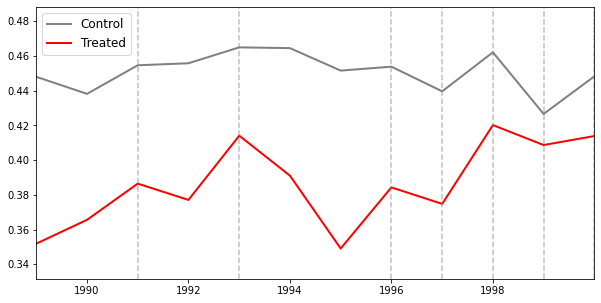

# undidPyjl
Difference-in-differences for unpoolable data. Python wrapper for Undid.jl.

## Installation
**Option 1 (recommended): Install from [PyPI](https://pypi.org/project/undidPyjl/)**
```bash
pip install undidPyjl
```

**Option 2: Install from GitHub**
```bash
git clone https://github.com/ebjamieson97/undidPyjl.git
cd undidPyjl
python setup.py install
```

## Requirements
- Julia >= 1.0
- Python >= 3.6
- juliacall >= 0.9.20
- pandas >=1.2.4, <2.0
- numpy >=1.20.3, <1.23.0
- matplotlib >=3.4.0, <3.6

### Utility Functions: For managing the Undid.jl package for Julia from Python

#### 1. `checkundidversion()`
Checks the version of Undid.jl currently installed in Julia. If it is not installed, installs the most recent version from https://github.com/ebjamieson97/Undid.jl.

#### Example
```python
from undidPyjl import julia_management as jlmg
jlmg.checkundidversion()
```

#### 2. `updateundid()`
Updates Undid.jl to the latest version. This may take a minute or so depending on network and system conditions.

#### Example 
```python
from undidPyjl import julia_management as jlmg
jlmg.updateundid()
```

## Stage One: Initialize

#### 3. `create_init_csv()` - Prints out a filepath to the created `init.csv`
Creates the initial 'init.csv' file from which the 'empty_diff_df.csv' is built. If `create_init_csv()` is called without providing any silo names, start times, end times, or treatment times, an `init.csv` will be created with the appropriate column headers and blank columns. 

Covariates may be specified when calling `create_init_csv()` or when calling `create_diff_df()`.

Ensure that dates are all entered in the same date format, a list of acceptable date formats can be seen [here.](#valid-date-formats)

**Parameters:**

- **silo_names** (*list of str, optional*):  
  List of silo names. Defaults to an empty list.
  
- **start_times** (*list of str, optional*):  
  List of start times for each silo. Defaults to an empty list.

- **end_times** (*list of str, optional*):  
  List of end times for each silo. Defaults to an empty list.

- **treatment_times** (*list of str, optional*):  
  List of treatment times for each silo. Set treatment time to "control" for silos which never receive treatment. Defaults to an empty list.

- **covariates** (*list of str or bool, optional*):  
  Either a list of covariates to include in the analysis or `False` to omit covariates. Defaults to `False`.

#### Example
```python
from undidPyjl import stageone as stageone
stageone.create_init_csv(silo_names = ["71", "73"], 
start_times = ["1989","1989"],
end_times = ["2000","2000"], 
treatment_times = ["1991","control"])
```

#### 4. `create_diff_df()` - Returns a filepath and a Julia dataframe
Generates the `empty_diff_df.csv` file. The `empty_diff_df.csv` file is sent to each silo in order to be filled out.

Covariates may be specified when calling `create_init_csv()` or when calling `create_diff_df()`.

**Parameters:**

- **filepath** (*str*):  
  Filepath to the `init.csv` file that was previously created.

- **date_format** (*str*):  
  The date format used in the `init.csv` file (e.g., `"YYYY-MM-DD"` for all possible formats see [here](#valid-date-formats)).

- **freq** (*str*):  
  Frequency of the data to be considered for analysis at each silo. Options are `"daily"`, `"weekly"`, `"monthly"`, or `"yearly"`.

- **covariates** (*list of str or bool, optional*):  
  A list of strings specifying covariates for each silo, or `False` to use the covariates specified in the `init.csv` file. Defaults to `False`.

- **freq_multiplier** (*int or bool, optional*):  
  An integer to multiply the `freq` argument by, to handle intervals larger than the base frequency. For example, for biweekly data, set `freq="weekly"` and `freq_multiplier=2`. Defaults to `False`.

#### Example 
```python
from undidPyjl import stageone as stageone
stageone.create_diff_df("c:\\Users\\User\\Documents\\Project Files\\init.csv",
date_format = "yyyy", freq = "yearly")
```

## Stage Two: Silo

#### 5. `undid_stage_two()` - Prints filepaths and returns Julia dataframes
The `undid_stage_two()` function uses date information from the `empty_diff_df.csv` and the local silo data to fill in the necessary diff_estimates.

Ensure that the `local_silo_name` reflects the spelling of the silo in the `empty_diff_df.csv` file. Likewise, ensure that the covariates specified in the `empty_diff_df.csv` are spelled the same in the local silo data.

Also be sure that the `time_column` contains only `string` values. This is in order to enable passing data back and forth between Julia and R. 

**Parameters:**

- **filepath** (*str*):  
  Filepath to the `empty_diff_df.csv` file.

- **silo_name** (*str*):  
  Name of the silo being analyzed, as it is spelled in the `empty_diff_df.csv`.

- **silo_data** (*pandas.DataFrame*):  
  A pandas DataFrame containing the data for the specific silo.

- **time_column** (*str*):  
  The name of the column in `silo_data` that contains date values. This column should contain date strings whose format is specified by `date_format`.

- **outcome_column** (*str*):  
  The name of the column in `silo_data` that contains the outcome variable for the analysis.

- **date_format** (*str*):  
  The format of the dates in the `time_column` (e.g., `"YYYY/MM/DD"`).

- **consider_covariates** (*bool, optional*):  
  Whether to consider the covariates specified in the `empty_diff_df.csv` during the analysis. Defaults to `True`. Consider setting to `False` if the specified covariates do not exist in the local silo data.

#### Example
```python
import pandas as pd
from undidPyjl import stagetwo as stagetwo
local_silo_data = pd.read_stata("C:\\Users\\User\\Local Data\\State71.dta")
filepath = "C:\\Users\\User\\Downloads\\empty_diff_df.csv"
stagetwo.undid_stage_two(filepath = filepath, silo_name = "71",
silo_data = local_silo_data, time_column = "year", outcome_column = "coll",
date_format = "yyyy") 
```

## Stage Three: Analysis

#### 6. `undid_stage_three()` - Returns Julia dataframe of results and saves as `UNDID_results.csv`
The `undid_stage_three()` function combines the `filled_diff_df.csv`'s and computes the aggregate ATT by silo, gvar, or (g,t).

**Parameters:**

- **dir_path** (*str*):  
  Filepath to the directory containing all of the `filled_diff_df.csv` files.

- **agg** (*str, optional*):  
  Specifies the aggregation method. Options are:
  - `"silo"` (default): Aggregates by silo.
  - `"g"`: Aggregates by group.
  - `"gt"`: Aggregates by group and time.

- **covariates** (*bool, optional*):  
  Whether to consider covariates in the analysis. Defaults to `False`.

- **save_csv** (*bool, optional*):  
  Whether to save the combined `combined_diff_df.csv` file after aggregation. Defaults to `False`.

- **interpolation** (*str or bool, optional*):  
  Specifies how to handle missing values in the `filled_diff_df.csv` files. Options are:
  - `False` (default): No interpolation.
  - `"linear_function"`: Performs linear interpolation and extrapolation to fill in missing values.

#### Example
```python
from undidPyjl import stagethree as stagethree
stagethree.undid_stage_three(dir_path = "C:\\Users\\User\\Filled Diff Data")
```

#### 7. `plot_parallel_trends()` - Returns a Pandas dataframe of trends data and a shows a plot
The `plot_parallel_trends()` function combines the `trends_data.csv`'s and plots parallel trends figures. There are a plethora of options for this function. Many parameters are inherited from `matplotlib`.

Of particular note is that the `date_format` parameter in `plot_parallel_trends()` inherits the date format options from `matplotlib.dates`, and consequently `date_format` should take in a typical `matplotlib` format type such as "%Y-%m-%d". 

There are controls for tick marks, titles, line width, labels, colours, legend options, and more.

**Parameters:**

- **dir_path** (*str*):  
  Filepath to the folder containing the `trends_data.csv` files.

- **covariates** (*bool, optional*):  
  If set to true, plots the outcome variable residualized by covariates. Defaults to `False`.

- **save_csv** (*bool, optional*):  
  Whether to save the combined trends data as a .csv file. Defaults to `False`.

- **combine** (*bool, optional*):  
  Whether to combine all control silos and treated silos. Defaults to `False`.

- **figsize** (*tuple, optional*):  
  Size of the plot figure, in the format (width, height). Defaults to (10, 5).

- **control_colour** (*str or list of str, optional*):  
  Colour(s) for the control group. Can be a single string or a list of two strings to create a gradient. Defaults to `["#D3D3D3", "#4D4D4D"]`.

- **treated_colour** (*str or list of str, optional*):  
  Colour(s) for the treated group. Can be a single string or a list of two strings to create a gradient. Defaults to `["#F08080", "#800020"]`.

- **control_color** (*str or None, optional*):  
  Overrides `control_colour` if provided. Defaults to `None`. 

- **treated_color** (*str or None, optional*):  
  Overrides `treated_colour` if provided. Defaults to `None`. 

- **linewidth** (*int, optional*):  
  Line width for the plot lines. Defaults to `2`.

- **title** (*str or None, optional*):  
  Title of the plot. Defaults to `None`.

- **xlabel** (*str or None, optional*):  
  Label for the x-axis. Defaults to `None`.

- **ylabel** (*str or None, optional*):  
  Label for the y-axis. Defaults to `None`.

- **title_fontdict** (*dict or None, optional*):  
  Dictionary of font properties for the title. Defaults to `None`.

- **title_loc** (*str, optional*):  
  Location of the title. Defaults to `"center"`.

- **title_pad** (*float or None, optional*):  
  Padding between the title and the plot. Defaults to `None`.

- **xlabel_fontdict** (*dict or None, optional*):  
  Dictionary of font properties for the x-axis label. Defaults to `None`.

- **ylabel_fontdict** (*dict or None, optional*):  
  Dictionary of font properties for the y-axis label. Defaults to `None`.

- **xlabel_pad** (*float or None, optional*):  
  Padding between the x-axis label and the plot. Defaults to `None`.

- **ylabel_pad** (*float or None, optional*):  
  Padding between the y-axis label and the plot. Defaults to `None`.

- **ylim** (*tuple or None, optional*):  
  Limits for the y-axis. Defaults to `None`.

- **yticks** (*list or None, optional*):  
  List of y-axis ticks. Defaults to `None`.

- **yticksize** (*int, optional*):  
  Font size for the y-axis ticks. Defaults to `10`.

- **xticks** (*list or None, optional*):  
  List of x-axis ticks. Can be date objects or strings (use `date_format` for strings). Defaults to `None`.

- **xticksize** (*int, optional*):  
  Font size for the x-axis ticks. Defaults to `10`.

- **date_format** (*str, optional*):  
  Date format for x-axis ticks. Defaults to `"%Y"`. It should be noted that this using the formatting options inherited from `matplotlib.dates`, i.e. in the general format of "%Y-%m-%d".
  Any other date arguments entered as strings to `plot_parallel_trends()` should be entered in the `date_format` specified here.

- **legend_loc** (*str, optional*):  
  Location of the legend. Defaults to "best".

- **legend_fontsize** (*int, optional*):  
  Font size for the legend. Defaults to `12`.

- **legend_on** (*bool, optional*):  
  Whether to display the legend. Defaults to `True`.

- **treatment_indicator_col** (*str, optional*):  
  Colour of the treatment indicator lines. Defaults to `"grey"`.

- **treatment_indicator_linestyle** (*str, optional*):  
  Line style for the treatment indicator lines. This parameter inherits the available options from the `linestyle` argument in `matplotlib.pyplot.axvline()`.  
  Common options include:
  - `'-'` (solid line)
  - `'--'` (dashed line)
  - `'-.'` (dash-dot line)
  - `':'` (dotted line)  
  Defaults to `"--"`.

- **treatment_indicator_linewidth** (*float, optional*):  
  Line width for the treatment indicator lines. Defaults to `1`.

- **treatment_indicator_alpha** (*float, optional*):  
  Transparency for the treatment indicator lines. Defaults to `0.5`.

- **xlim** (*tuple or None, optional*):  
  Limits for the x-axis, as date objects or strings (specify the `date_format` for strings). Defaults to `None`.

- **savefig** (*bool, optional*):  
  Whether to save the plot as a PNG file. Defaults to `False`.

- **dpi** (*int, optional*):  
  Resolution of the saved figure. Defaults to `300`.

- **bbox_inches** (*str, optional*):  
  Controls the amount of the figure to include when saving. Defaults to "tight".

- **overlap_alpha** (*float, optional*):  
  Transparency for the lines of treated and control groups. Defaults to `0.9`.

- **simple_legend** (*bool, optional*):  
  Whether to use a simplified legend (just "Control" and "Treated"). Defaults to `True`.

#### Example
```python
from undidPyjl import stagethree as stagethree
df = stagethree.plot_parallel_trends("C:\\Users\\User\\Filled Trends Data", 
    combine=True, 
    xticks = ["1990", "1992", "1994", "1996","1998"], 
    date_format = "%Y",
    control_colour = "grey",
    treated_colour = "red",
    treatment_indicator_linewidth = 1.5) 
```


## Appendix

#### Valid Date Formats
- `ddmonyyyy` → 25aug1990
- `yyyym00` → 1990m8
- `yyyy/mm/dd` → 1990/08/25
- `yyyy-mm-dd` → 1990-08-25
- `yyyymmdd` → 19900825
- `yyyy/dd/mm` → 1990/25/08
- `yyyy-dd-mm` → 1990-25-08
- `yyyyddmm` → 19902508
- `dd/mm/yyyy` → 25/08/1990
- `dd-mm-yyyy` → 25-08-1990
- `ddmmyyyy` → 25081990
- `mm/dd/yyyy` → 08/25/1990
- `mm-dd-yyyy` → 08-25-1990
- `mmddyyyy` → 08251990
- `mm/yyyy` → 08/1990
- `mm-yyyy` → 08-1990
- `mmyyyy` → 081990
- `yyyy` → 1990

